# Практика 10. Сетевой уровень (сдать до 11.05.2023) 

## 1. Wireshark. IP (8 баллов) 

1. Мой IP=192.168.0.157

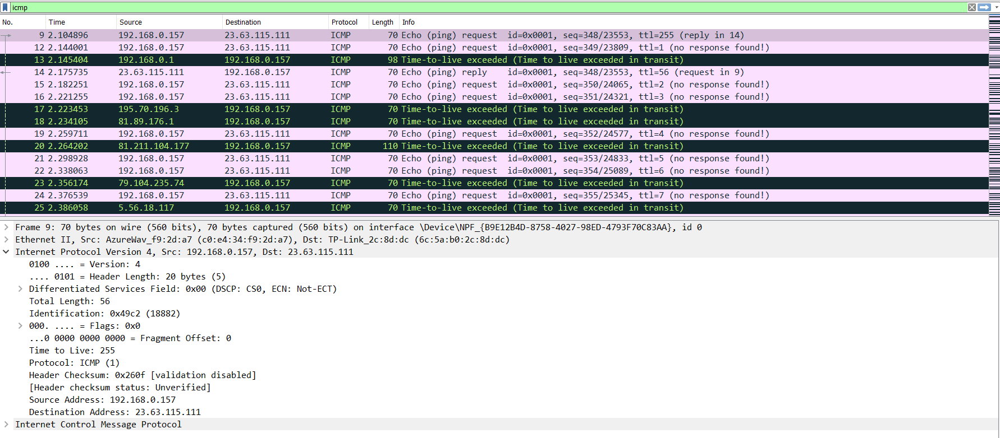

2. Protocol: ICMP (1)

3. 20 байт приходится на заголовок. И, соответсвенно, на полезную нагрузку 56 - 20 = 36 байт.

4. 
    - `Time to live`, `Identification`, `Checksum` - меняющиеся параметры  
    - Параметры которые не должны меняться: `версия протокола`, `IP адреса`, `размер пакета`, `флаги`, `Differentiated Services Field`.
    - `Identification` увеличивается на 1, при разных `IP destination` происходит большой скачок в их значений. 

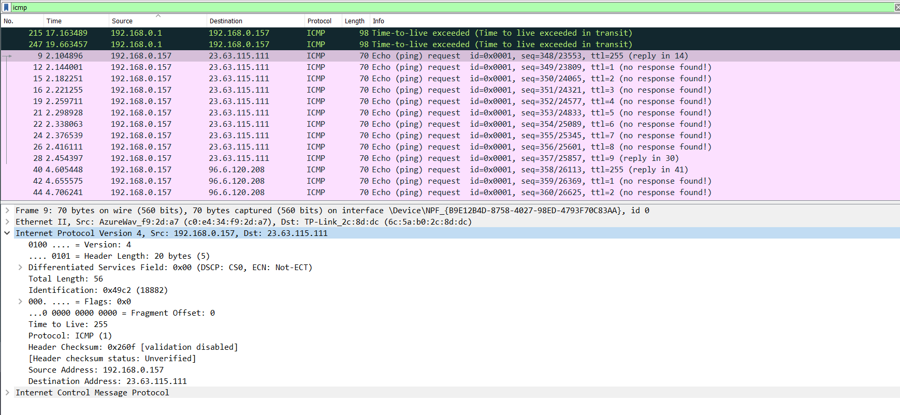

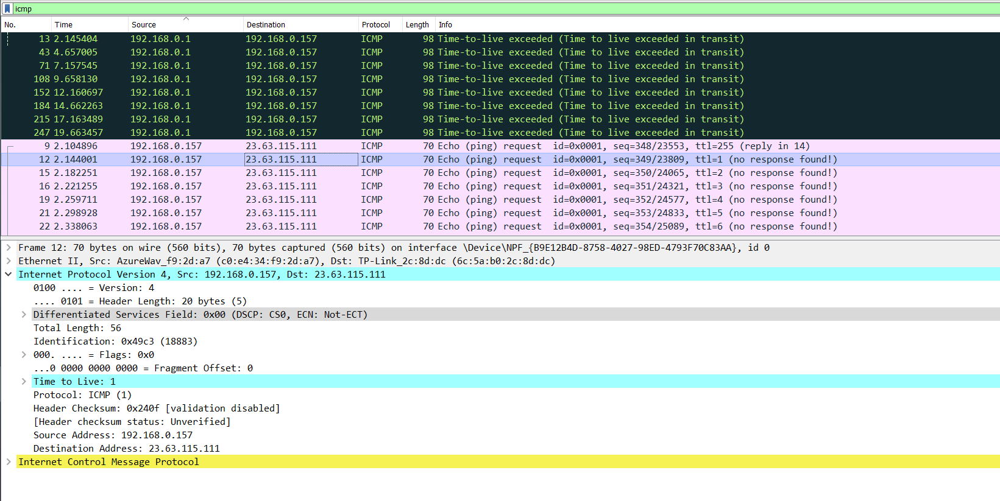

5. 
    - `Identification` необходим для определения пакета и занимает 2 байта. [18891]
    - `TTL` - время жизни пакета [9]

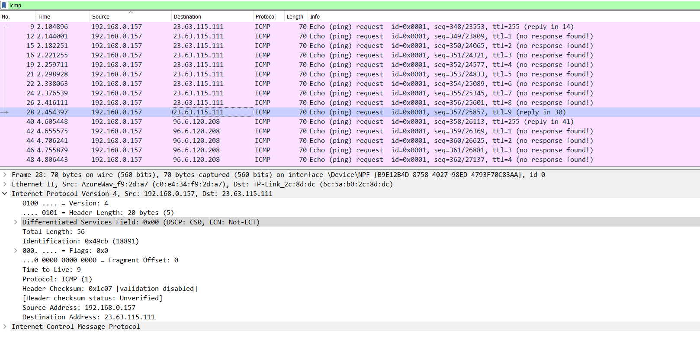

6. Как можно заметить, `TTL` - остаётся неизменным, а `Identification` изменяется.

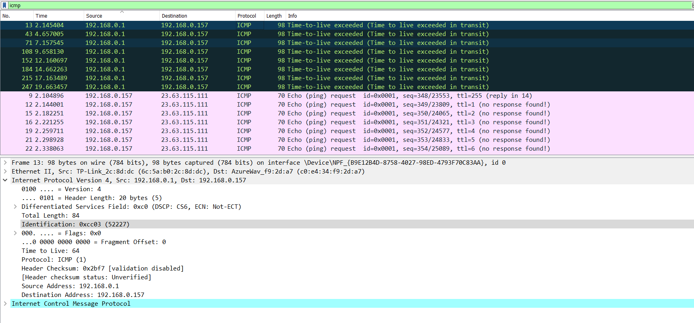
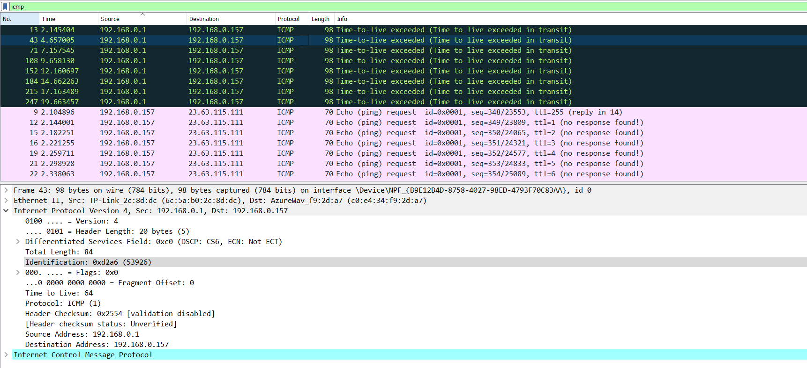
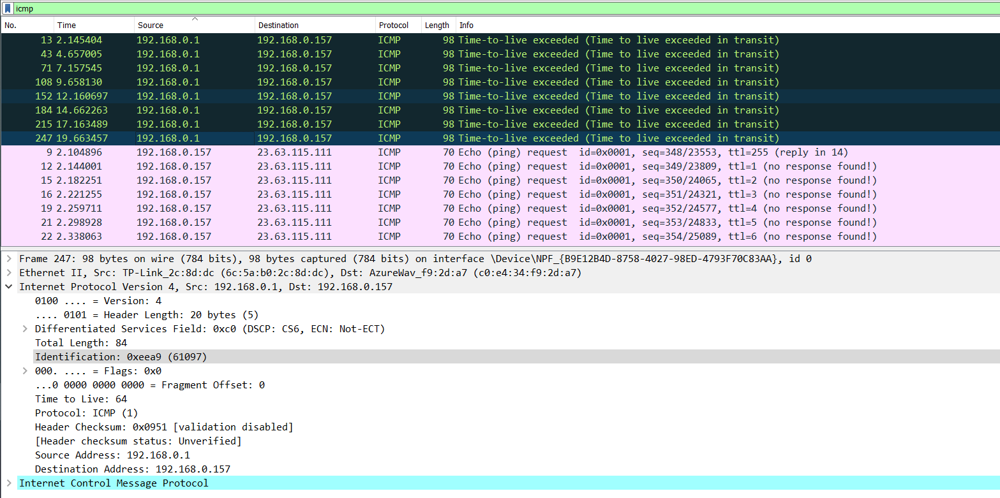

7. `Identification=0xcc03 (52227)`, `TTL=64`,  

8.  C `Packet Size = 3500 байт` у меня пакеты не доходят полный путь.  Могу сказать пакет фрагментируется на 3 части.

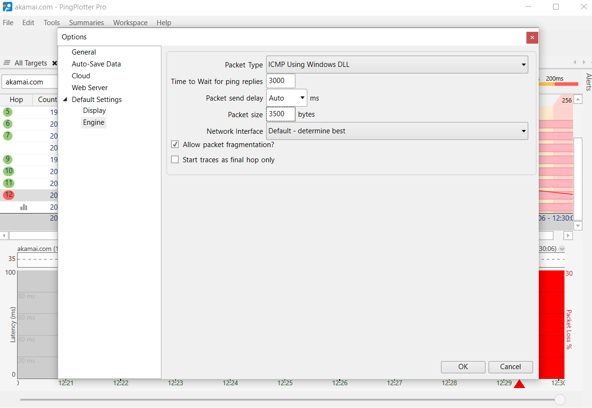

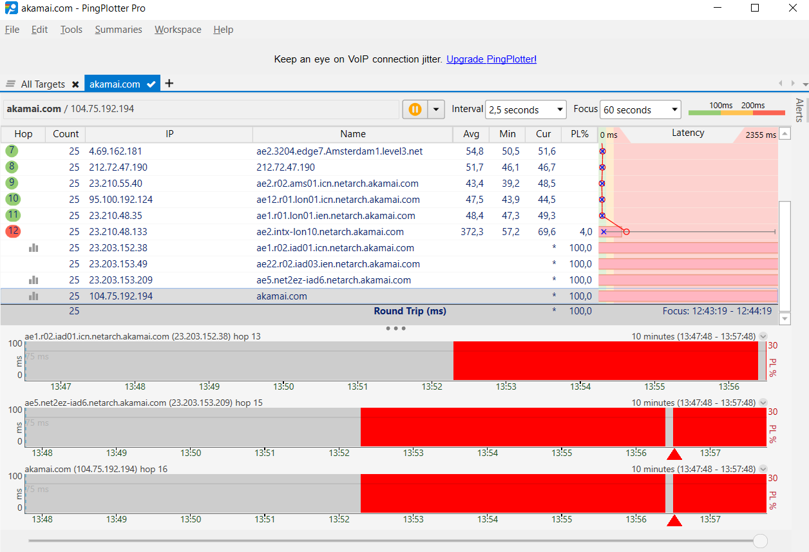

- Изменяются `Checksum`, `Flags`, `Fragmen offset` и в последнем `Total length`.

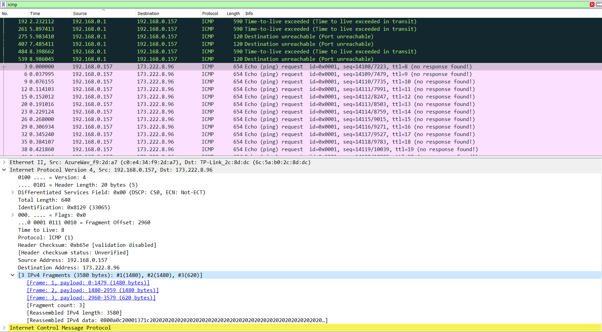

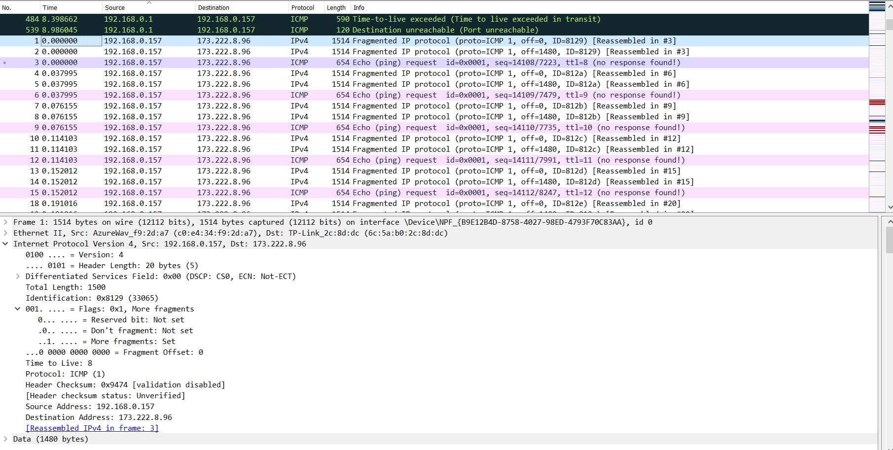

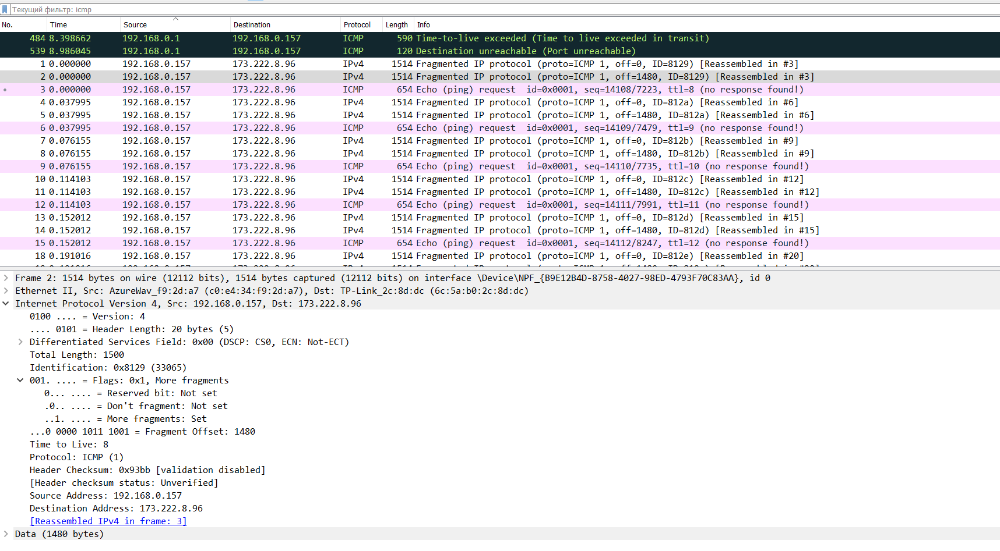