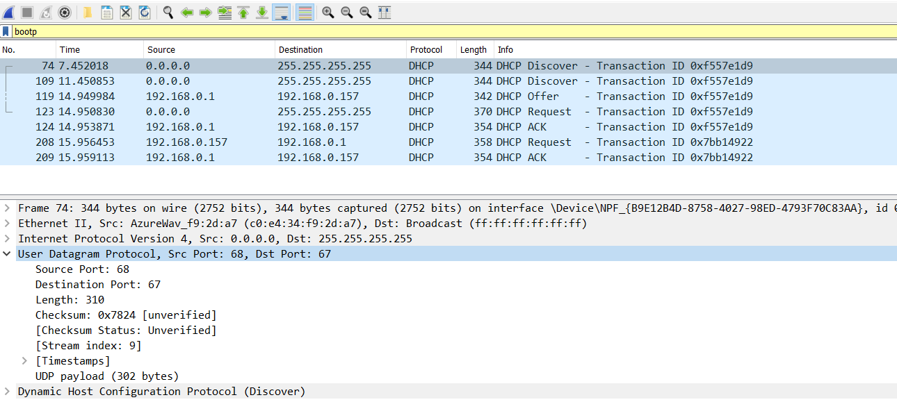
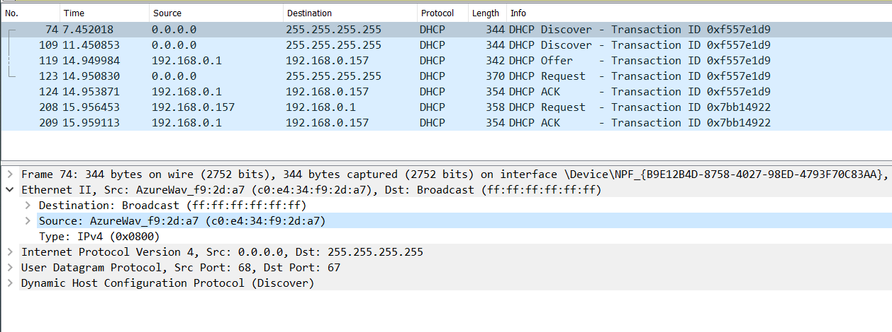
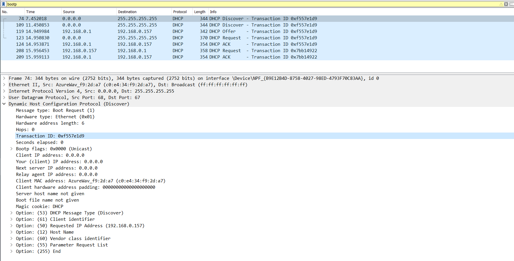
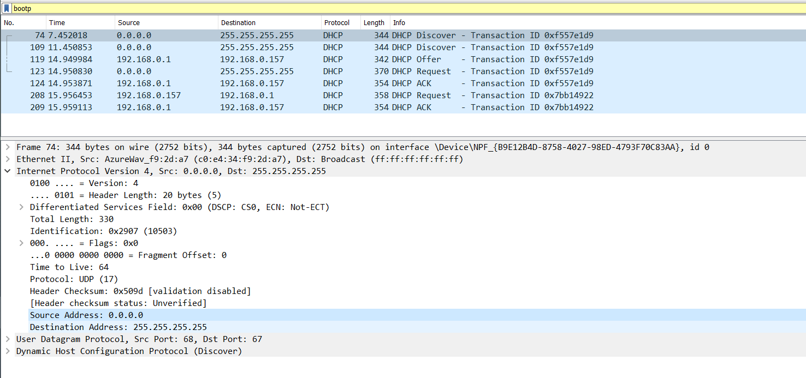
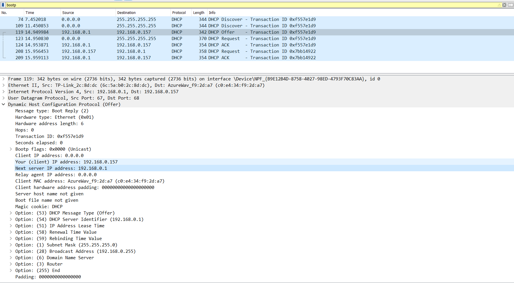
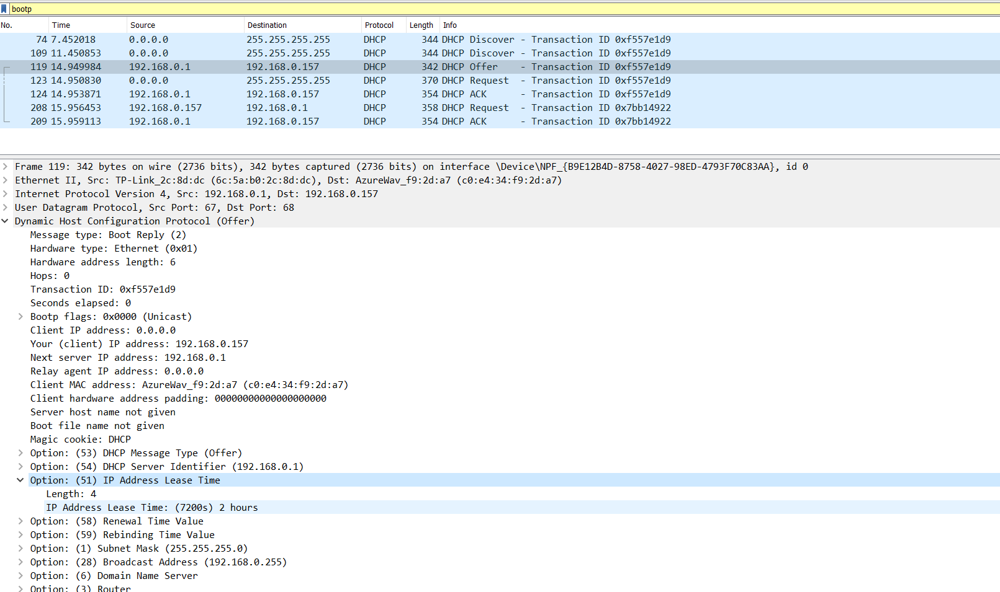

# Практика 13. Канальный уровень (сдать до 27.05.2023) 

## 1. Wireshark : DHCP (4 балла)

1. Сообщения DCHP посылаются поверх протокола UDP

2.  Адрес канального уровня моего хоста :  `c0:e4:34:f9:2d:a7`

3. `Transaction ID: 0xf557e1d9` . Он нужен для соответствия DCHP запросов-ответов.

4. До присвоения IP адреса хост имеет адрес `0.0.0.0`, а соответсвенно принимающий имеет `255.255.255.255`

5. в IP-адрес моего DHCP-сервера: `192.168.0.1`

6. IP адреса выдаются DHCP временно. Конкретно мне выдали на 2 часа.

## 3. Задачи 
## 1. Задача (2 балла) 
a. 
Посчитаем производную по $p$ и приравняем к нулю
$(N p (1 - p) ^ {N - 1})' = (N (1 - p) ^ {N - 1}) + (-Np(1 - p) ^ {N -2} (N - 1)) = N (1 - p) ^ {N - 2} ((1 - p) - p(N - 1)) = N (1 - p) ^ {N - 2} (1 - Np) = 0$ 

Корни $p = \frac{1}{N}, p  = 1$, второй не подходит.  

b. Получаем:  

$( \frac{1}{N} N (1 - \frac{1}{N}) ^ {N - 1}) = (1 + \frac{1}{-N}) ^ {N - 1} = [(1 + \frac{1}{-N}) ^ {(-N)}] ^ {-1} *  (1 - \frac{1}{N})$ первая часть стремится к второму замечательному пределу $e ^ {-1}$, а вторая к 1.  Получаем, что эффективность дискретного протокола ALOHA в пределе равна $\frac{1}{e}$ .