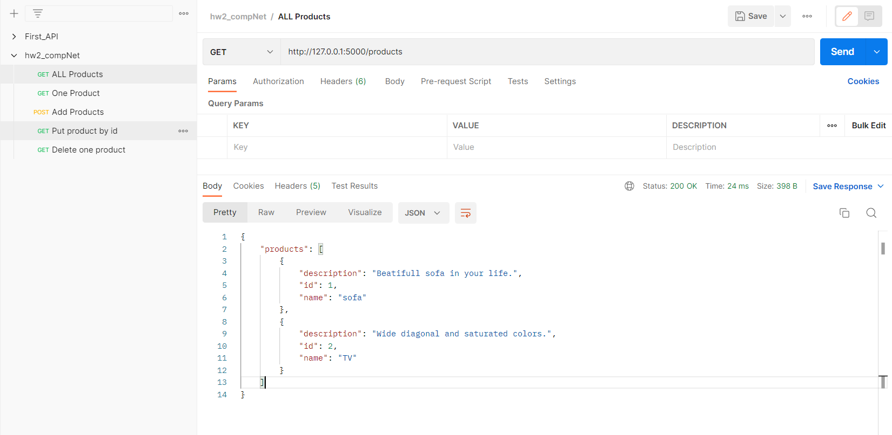
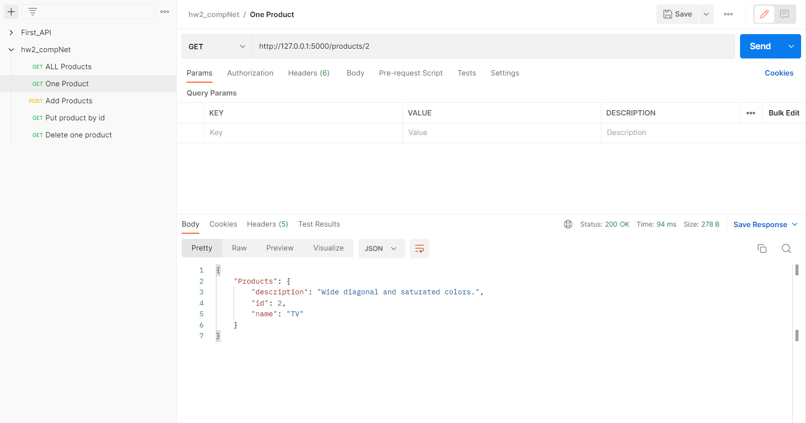
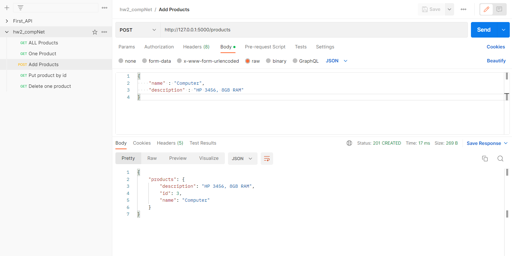
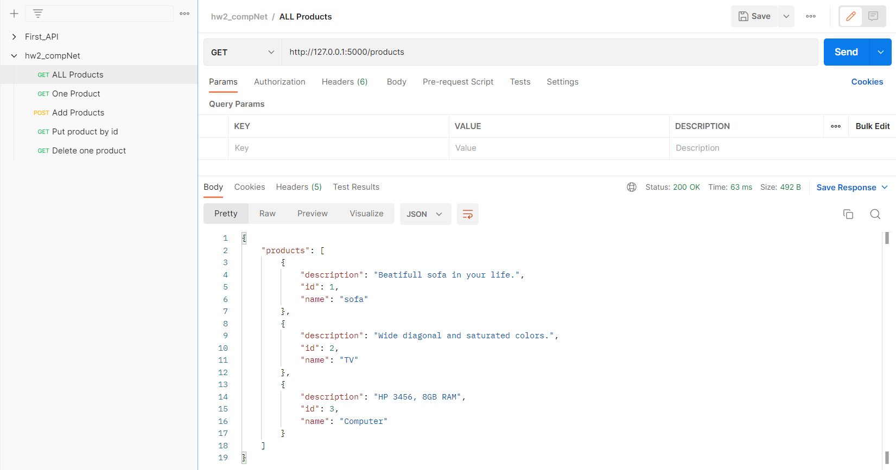
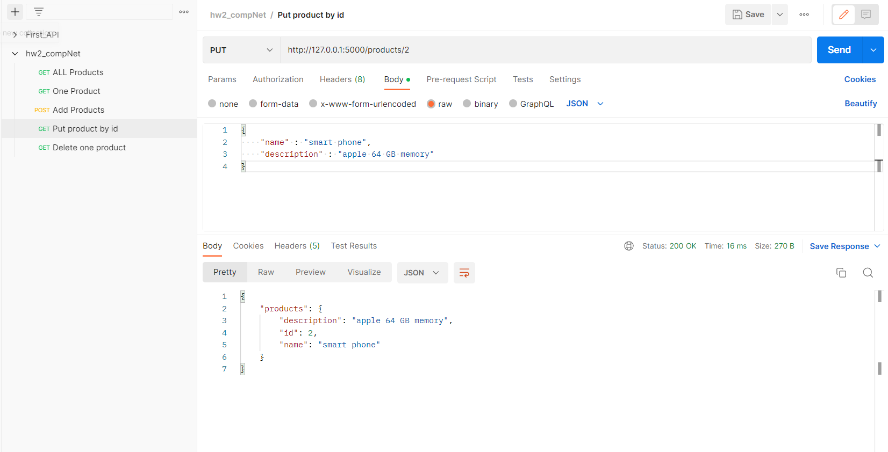
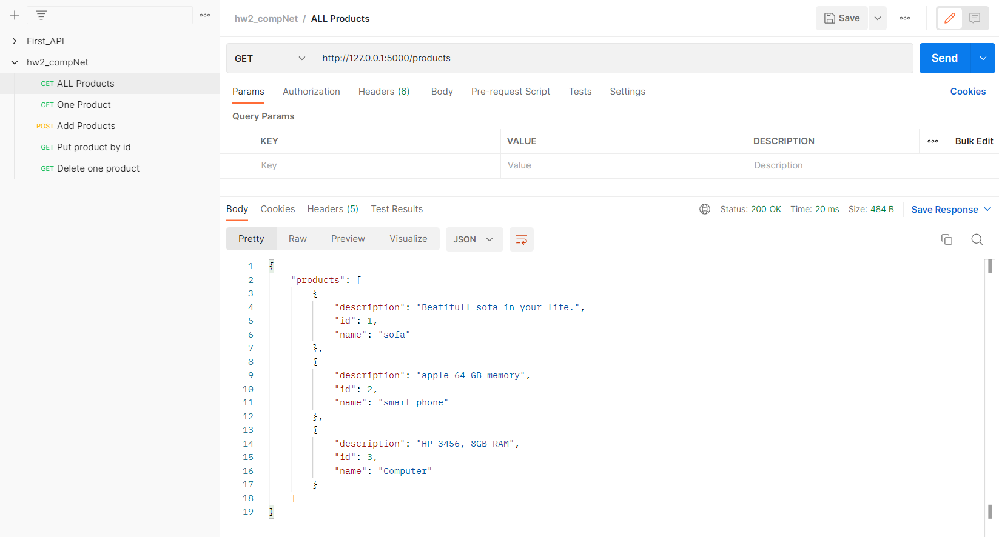
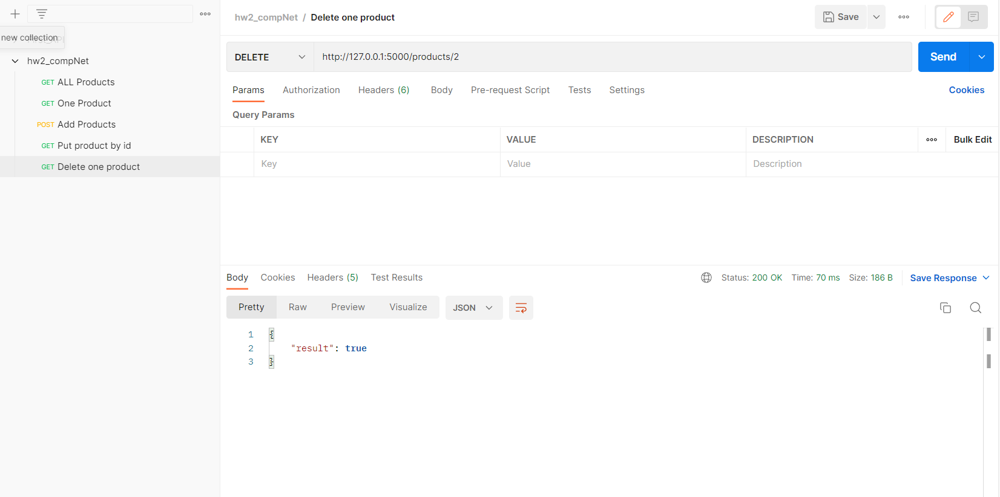
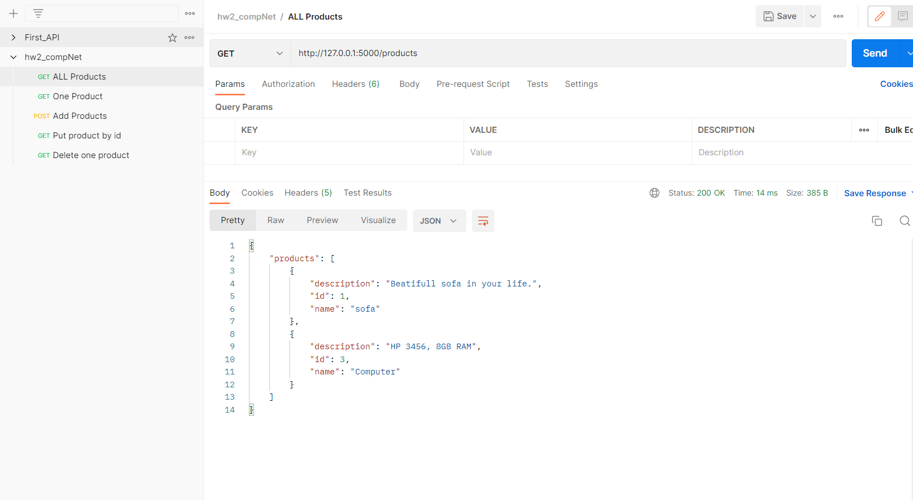

# Практика 2. Rest Service (сдать до 02.03.2023) 

## 1. Программирование. Rest Service. Часть I 

* Нужно реализовать `GET`, `POST`, `PUT`, `DELETE` для товара `[/web_server]` (3 балла)
* Продемострировать с помощью `Postman` (3 балла)
* Добавить иконки к продуктам без визуализации (4 балла)

### API 
* `host = http://127.0.0.1:5000`
* `/products GET` - попросить список всех товаров
* `/products/<int:product_id> GET` - попросить  товар с `id=product_id`
* `/products/<int:product_id> POST` - добавить товар с `id=product_id`
* `/products/<int:product_id> PUT` - изменить товар с `id=product_id`
* `/products/<int:product_id> DELETE` - удалить товар с `id=product_id`

1. all_products

2. get_product_by_id

3. add_product_and_show_him

4. put_product_and_show_him

5. delete_product_and_show_all

