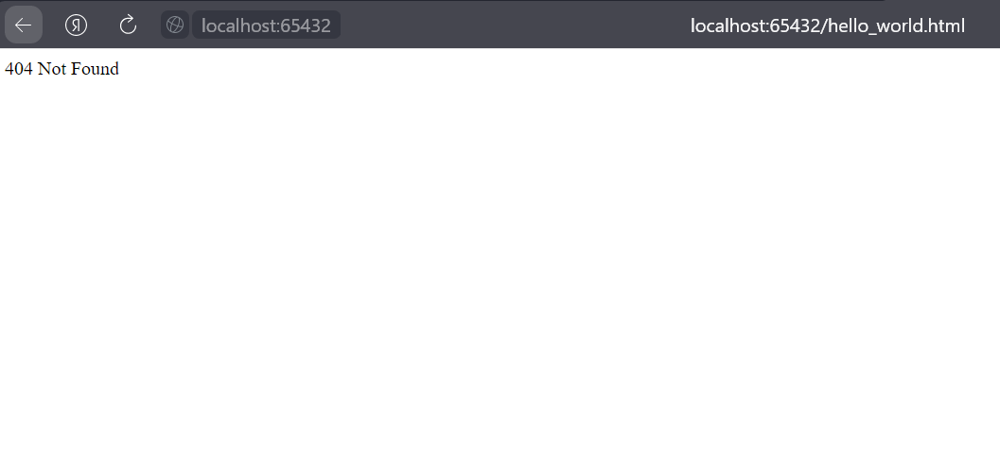
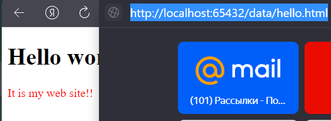
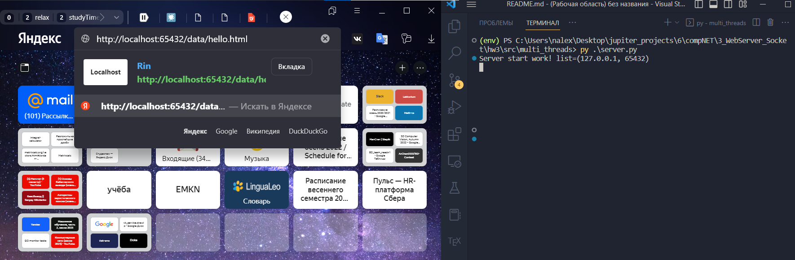
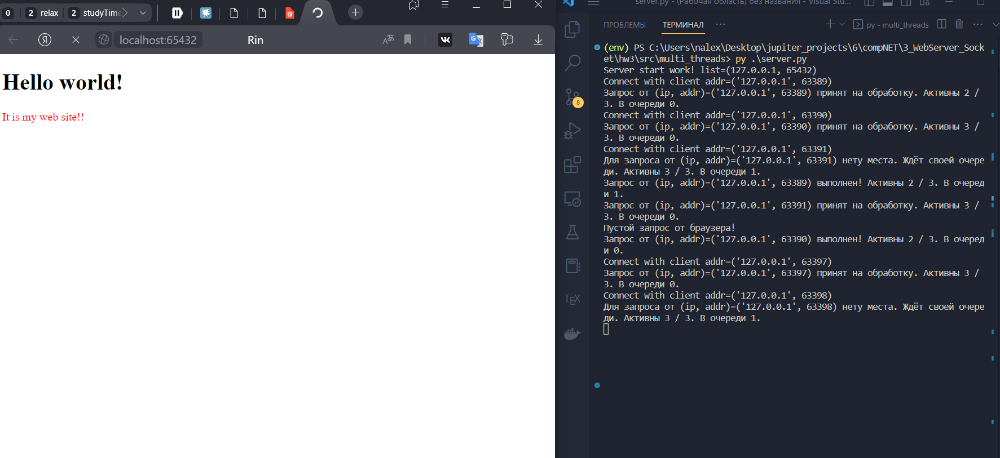
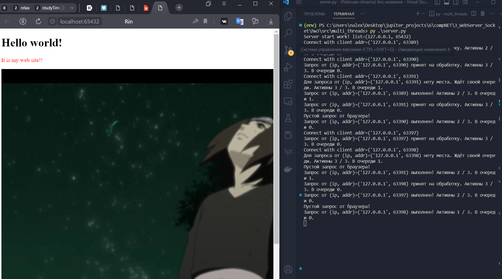
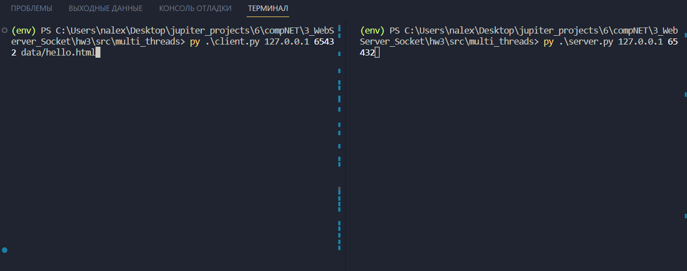
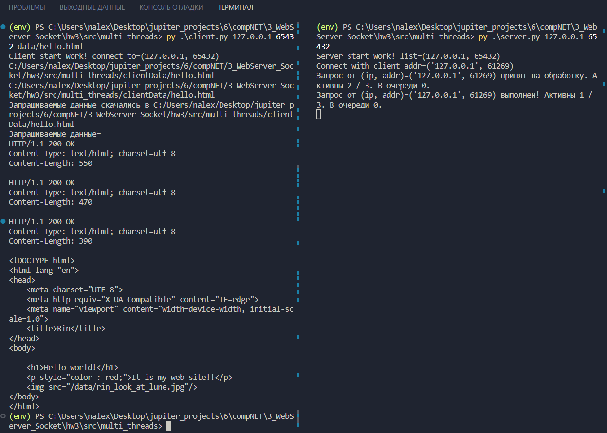

# Практика 3. Прикладной уровень (сдать до 09.03.2023) 

## 1. Программирование сокетов. Веб-сервер 

* А. Однопоточный веб-сервер (3 балла)

    + `./src/single_thread`
    + 
    + 

* Б. Многопоточный веб-сервер (2 балла) && Г. Ограничение потоков сервера (3 балла) 
    + `./src/multi_threads`
    + Сделаем, для наглядности, задержку для запроса : `time.sleep(10)`
    + Происходит следующее: Запрашивается `html` в котором есть картинка, но на неё не хватает процессов для обработки и она догружается уже через следующие 10 секунд. (Браузер почему то отправляет лишнии `http` пустые запросы после)
    + Замечание: один поток уходит на главный цикл
    +   
    + 
    +   

* В. Клиент (2 балла) 
    + `./src/multi_threads`
    + 
    + 

