# Wireshark. Работа с DNS 
## А. Утилита nslookup (1 балл) 
* Выполните nslookup, чтобы получить IP-адрес какого-либо веб-сервера в Азии 

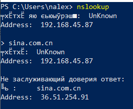

* Выполните nslookup, чтобы определить авторитетные DNS-серверы для какого-либо
университета в Европе 

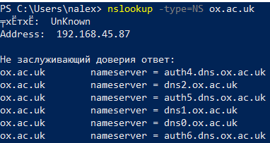

* Используя nslookup, найдите веб-сервер, имеющий несколько IP-адресов. Сколько IPадресов имеет веб-сервер вашего учебного заведения?

Сайт спбгу имеет 4 ip адресов.

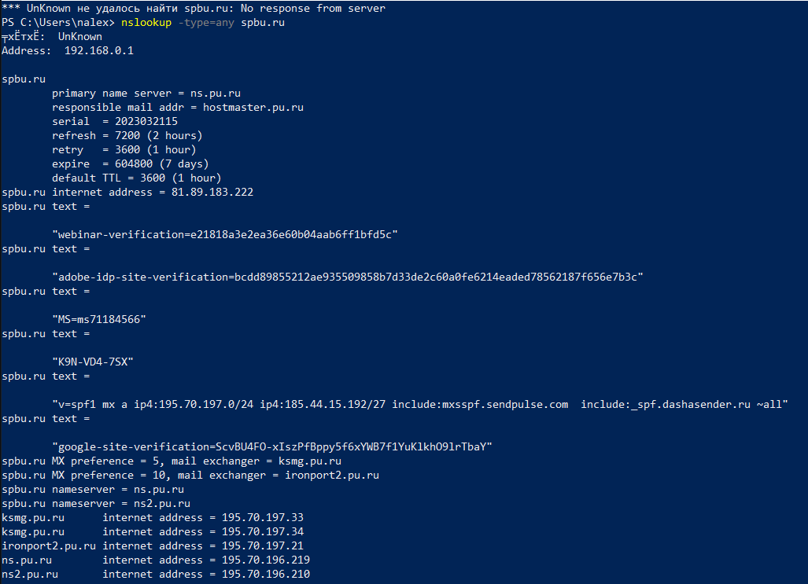

## Б. DNS-трассировка www.ietf.org (3 балла) 
1. UDP

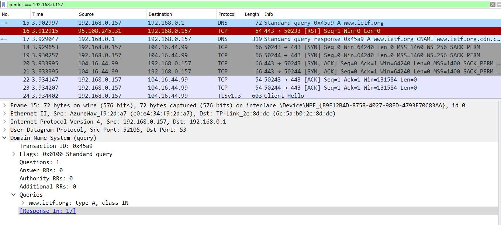

2. Port 53

3. Запрос направлен на сервер с IP=192.168.0.01 . IP - адреса DNS серверов совпадают.

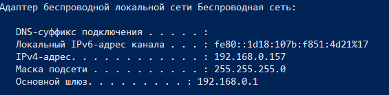

4. Запрашивается запрос вида A. Никаких ответов нету.

5. В response есть 3 ответа, содержащие name, type, class, time_to_live, data_length, address

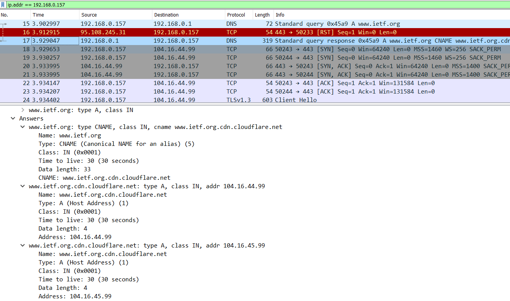

6. Последующий TCP запрос с флагом SYN отправлялся на такой же ip как и в третим ответе.

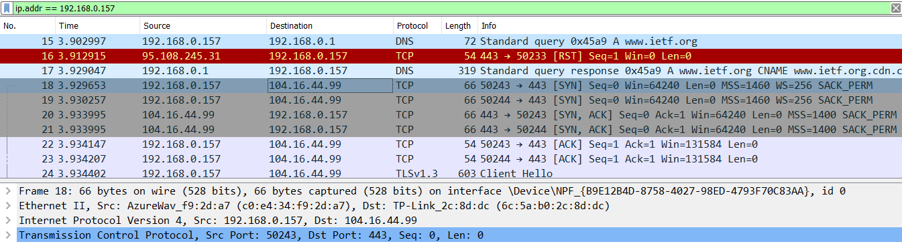

7. Следующий (и последний) DNS запрос запрашивал сайт с какой-то аналитикой, видимо он никак не связан с картинками. Тогда, думаю, что хост не выполняет повторные запросы.

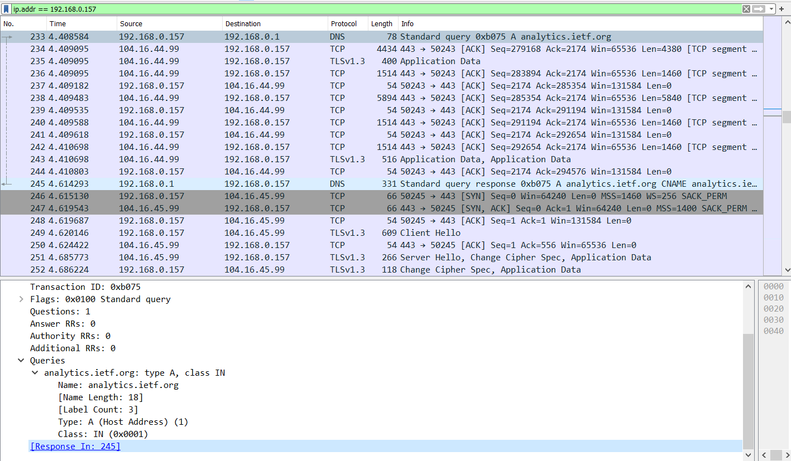

## В. DNS-трассировка www.spbu.ru (2 балла) 

1. Порт назначения в запросе DNS равен 53. Порт источника в DNS-ответе равен 53.

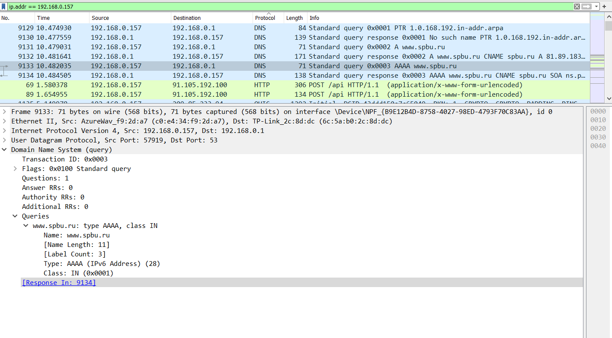
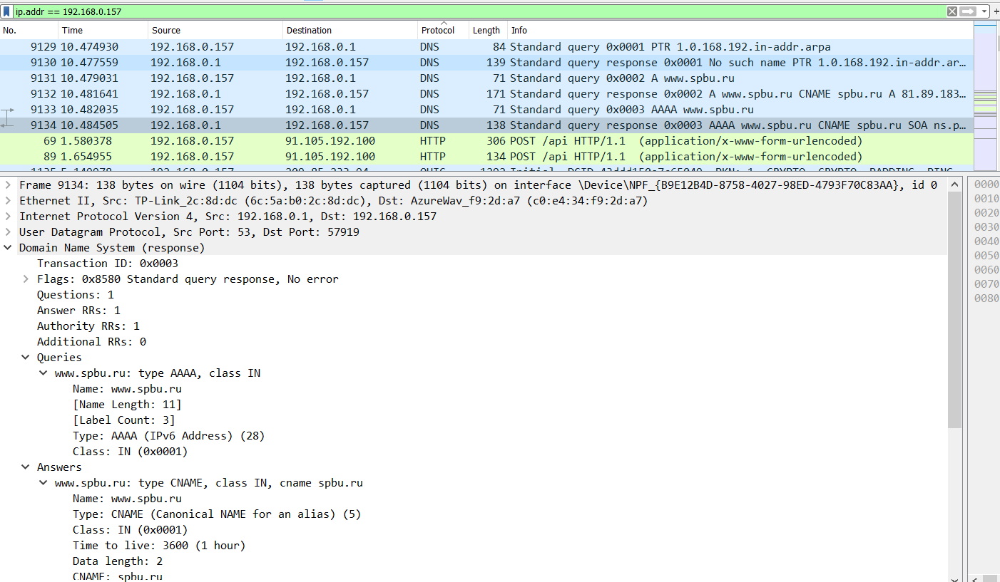

2. Запрос направлен на DNS сервер с ip=192.168.0.1. Это адрес локального DNS сервера по умолчанию. 

3. Запрашивается запрос типа AAAA. "Ответов" нету.

4. В response находится один ответ. Много информации с авторитетных серверов.

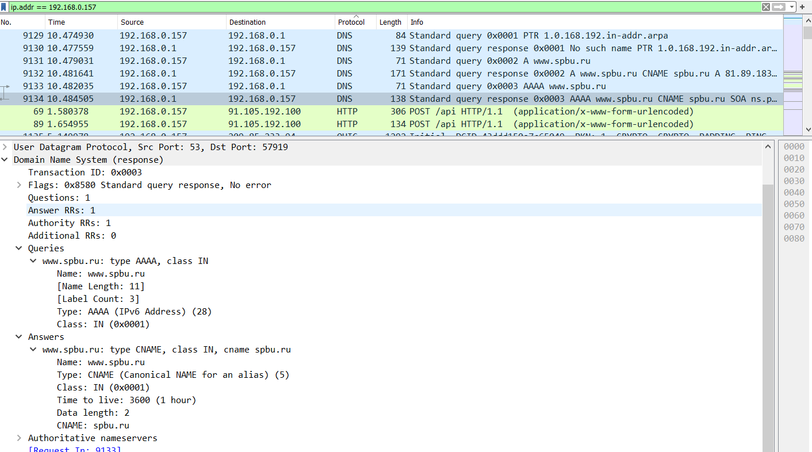

## Г. DNS-трассировка nslookup –type=NS (1 балл) 

1. Запросы идут на локальный дефолтный DNS сервер.

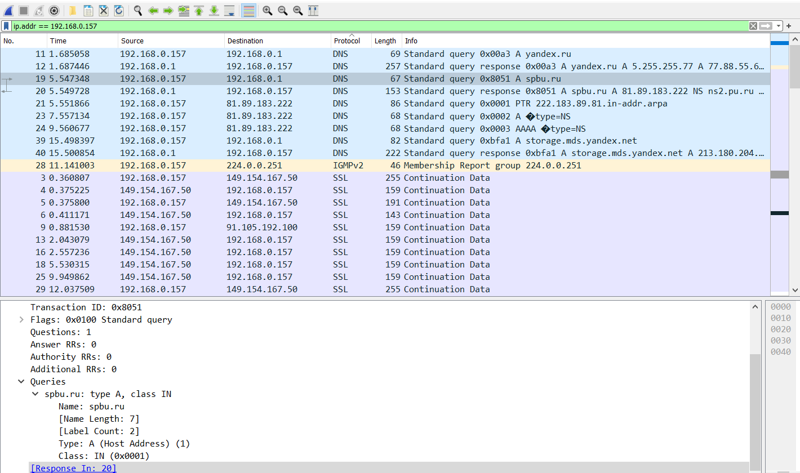

2. Ответов нету. Флага NS в запросе я не нашёл, но в response он есть!

3. 

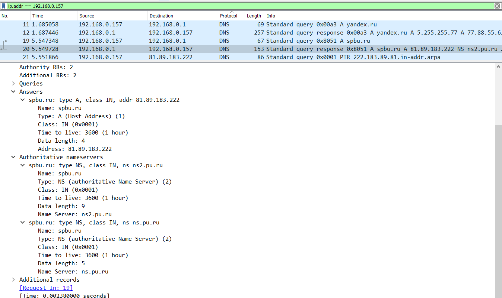

## Д. DNS-трассировка nslookup www.spbu.ru ns2.pu.ru (1 балл) 

## Е. Сервисы whois (2 балла) 

