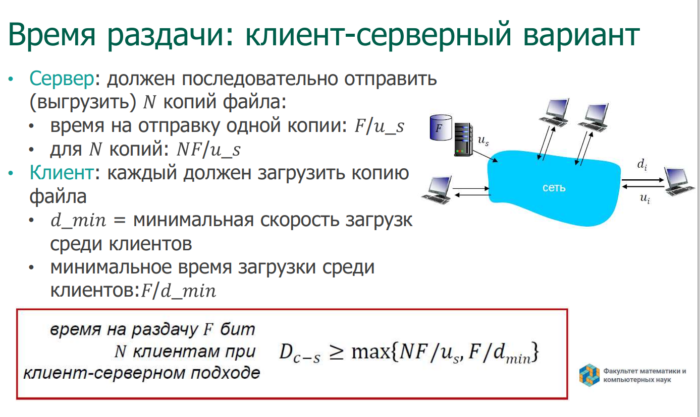
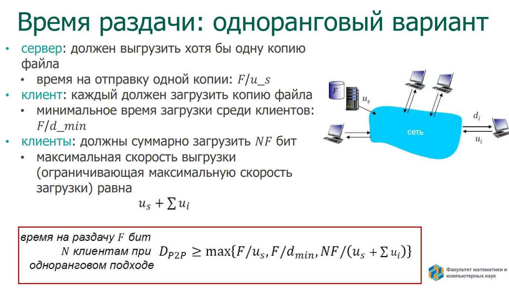
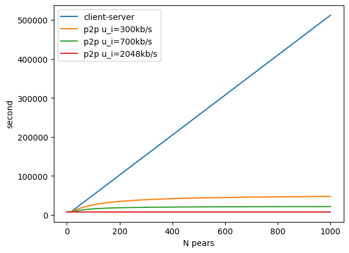

# ТеорЗадания

# 2 

# 3 

a. Дано u_s / N <= d_min. При условии, что скорость загрузки клиентов суммарно больше, чем скорость выдачи сервера. Тогда скорость упирается в N * F / u_s (размер файла для каждого пира на скорость сервера) т. к. если пири будут равномерно скачивать, их скорость загрузки выше.

b. Дано u_s / N >= d_min. Тогда время выдачи в F / d_min достигается, когда пиры суммарно готовы принять меньше, чем выдача сервера. Общее время будет зависит от самого медленого пира.

с. Склеем ва прошлых рехультата. В первром случае u_s / N  >  d_min достигается N * F / u_s > F / d_min <=> d_min > u_s / N. И симметричном случае аналогично. Тогда и получается, что минимальное время раздачи описывается формулой 𝑚𝑎𝑥{𝑁𝐹/𝑢_𝑠, 𝐹/𝑑_𝑚𝑖𝑛}.