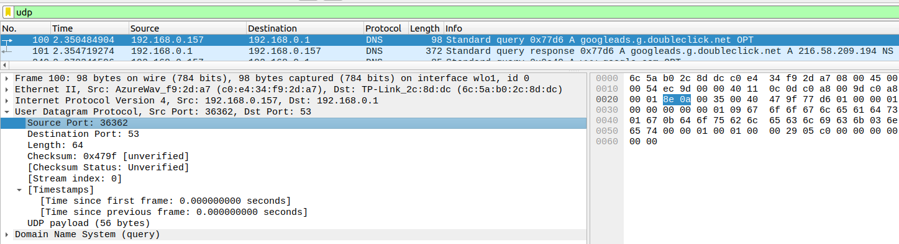
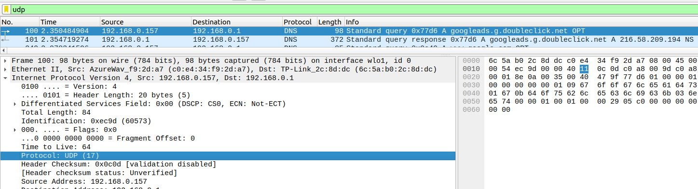
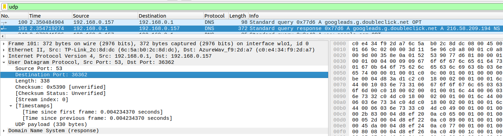

# Практика 6. Транспортный уровень (сдать до 06.04.2023)

## 1. Wireshark: UDP (5 баллов)

1. Выберите один UDP-пакет. По этому пакету определите, сколько полей содержит UDPзаголовок. 

 Всего 4 поля: `Source Port`, `Destination Port`, `Length`, `Checksum`.

2. Определите длину (в байтах) для каждого поля UDP-заголовка, обращаясь к отображаемой
информации о содержимом полей в данном пакете. 

Каждое поле занимает по 2 байта. (см. скрин)

3. Значение в поле `Length` (Длина) – это длина чего? 

В поле Length записано значение 64 байт. Это размер всего UDP-пакета с заголовком.  

4. Какое максимальное количество байт может быть включено в полезную нагрузку UDPпакета? 

Под значение `Length` выделяется 2 байта. Значит 2 ** 16 = 65 536 - 1 максимальное число, которое может записано (это размер всего пакета в байтах). (Что считать полезной нагрузкой, можно решить самому и вычесть например размер заголовка).

5. Чему равно максимально возможное значение номера порта отправителя? 

Размер поля `Source port` составляет 16 бит, то максимальный возможный порт отправителя равен 65535.

6. Какой номер протокола для протокола UDP? Дайте ответ и для шестнадцатеричной и
десятеричной системы. Чтобы ответить на этот вопрос, вам необходимо заглянуть в поле
Протокол в IP-дейтаграмме, содержащей UDP-сегмент. 

Номер протокола для протокола UDP равен 17.

7. Проверьте UDP-пакет и ответный UDP-пакет, отправляемый вашим хостом. Определите
отношение между номерами портов в двух пакетах.

Значения  `Source Port` и `Destination Port` меняются местами. (Отправитель и получаетль меняются местами) 

