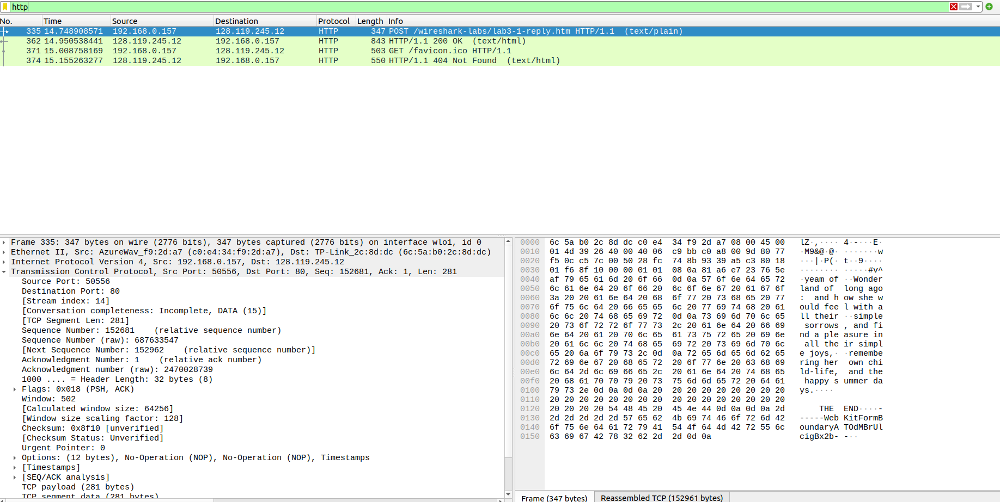
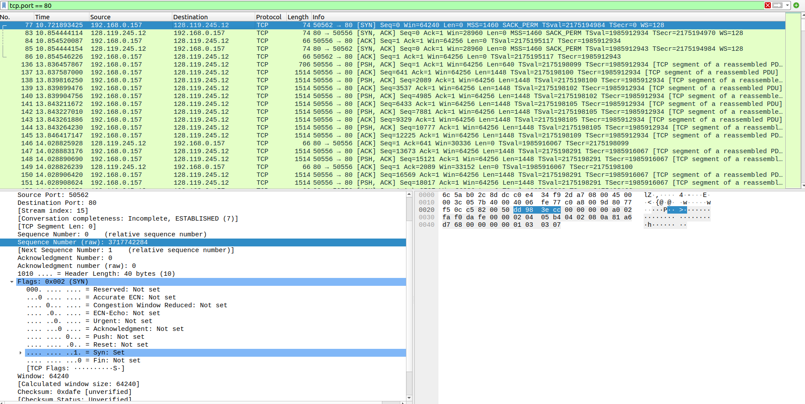
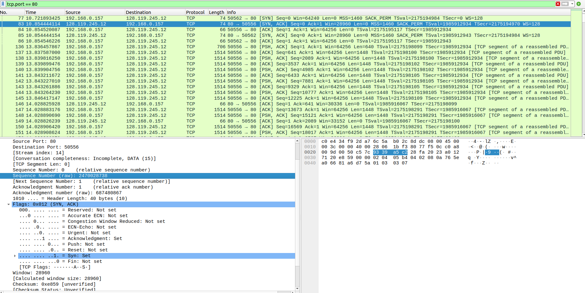
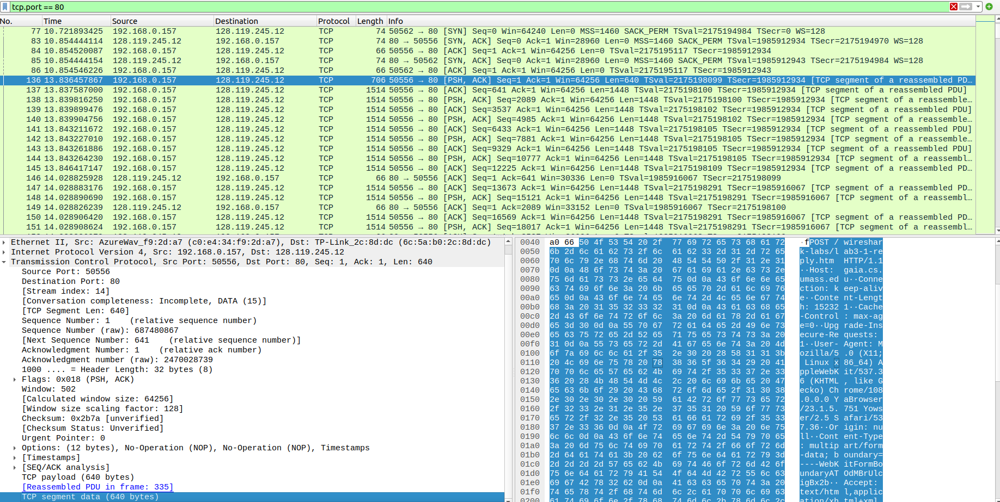
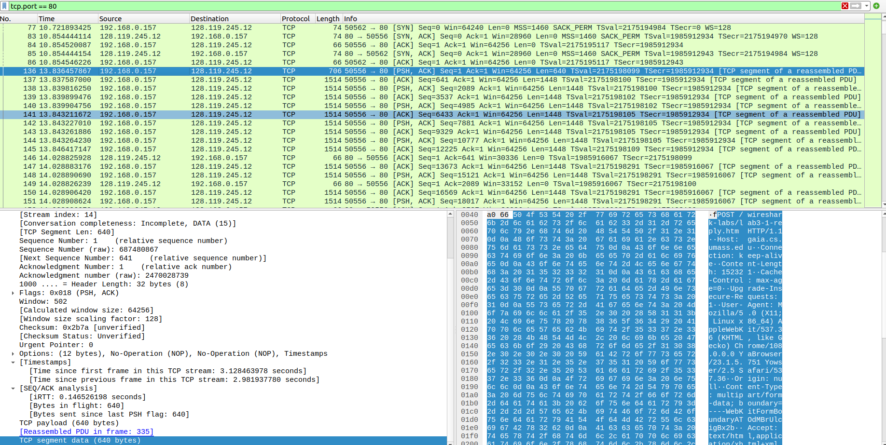
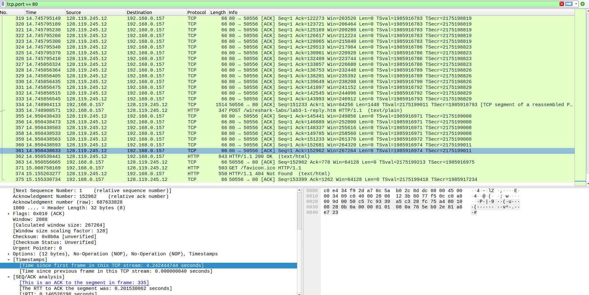

# Практика 7. Транспортный уровень (сдать до 13.04.2023) 

## 1. Wireshark: TCP (5 баллов) 
Перехват TCP-передачи данных от вашего компьютера удаленному серверу 

1. Какой IP-адрес и номер порта TCP использует ваш компьютер (отправитель), передающий
файл серверу gaia.cs.umass.edu? Для ответа на вопрос, возможно, проще выбрать httpсообщение и рассмотреть информацию TCP-пакета, используемого для передачи этого
http-сообщения, в окне деталей заголовка пакета 

Адрес клиента 192.168.0.157, порт 50576

2. Каков IP-адрес у сервера gaia.cs.umass.edu? Каковы номера портов для отправки и приема
TCP-сегментов этого соединения? 

IP-адрес у сервера gaia.cs.umass.edu равен 128.119.245.12, порт 80 для передачи данных.

`Основы TCP`

3. Какой порядковый номер у SYN TCP-сегмента, который используется для установления
TCP-соединения между компьютером клиента и сервером gaia.cs.umass.edu? Как
определяется, что это именно SYN-сегмент? 

Порядковый номер у `SYN` TCP-сегмента для установления TCP-соединения является 0. Этот сегмент можно распознать по флагу `Syn` в TCP заголовке.

4. Какой порядковый номер у SYNACK-сегмента, отправленного сервером gaia.cs.umass.edu
на компьютер клиента в ответ на SYN-сегмент? Какое значение хранится в поле
подтверждения в SYNACK-сегменте? Как сервер gaia.cs.umass.edu определил это значение?
Как определяется, что это именно SYNACK-сегмент?

Сегмент `SYNACK` идёт следующий. Он имеет `Seq=0`. Он имеет два флага `Acknowledgment`, `Syn`. В поле потверждение записан `2470028738` - это хеш функция от параметров полученого `SYN-пакета`.   

5. Какой порядковый номер у TCP-сегмента, содержащего команду POST протокола HTTP?
(для нахождения команды POST вам потребуется проникнуть внутрь поля содержимого
пакета в нижней части окна Wireshark, чтобы найти сегмент, в поле DATA которого
хранится значение POST) 

Порядковый номер сегмента TCP-пакета POST запроса равен 1. Можно проверить себя и посмотреть на расшифровку POST запроса из байтового представления справа-снизу

6. Рассмотрите TCP-сегмент, содержащий команду POST протокола HTTP, как первый TCPсегмент соединения. Какие порядковые номера у первых шести сегментов TCPсоединения (включая сегмент, содержащий команду POST протокола HTTP)? Когда был
отправлен каждый сегмент? Когда был получен ACK-пакет для каждого сегмента?
Покажите разницу между тем, когда каждый TCP-сегмент был отправлен и когда было
получено каждое подтверждение, чему равно значение RTT для каждого из 6 сегментов? 

>   |`No.Client` |  `SeqSend`  | `TimeSend`| `No.Server`| `TimeSend`|  `RTT = TimeSend - TimeSend` |     
>   |----| --------| --------------|------| --------|- |
>   |136 | 1       |   3.128463978 |146| 3.320832039| 0,192368061|
>   |137 | 641     |   3.129593111 |149| 3.320832350| 0,191239239 | 
>   |138 | 2089    |   3.131822361 |152| 3.320832390| 0,189010029 | 
>   |139 | 3537    |   3.131905587 |153| 3.320832430|0,188926843 | 
>   |140 | 4985    |   3.131910867 |154| 3.320832460| 0,188921593|   
>   |141 | 6433    |   3.135217783 |155| 3.320832500| 0,185614717

7. Чему равна пропускная способность (количество байтов, передаваемых в единицу
времени) для этого TCP-соединения? Объясните, как вы получили это значение. 

Попробуем оценить её на основе переданного полного POST запроса. 

Первый отправленный запрос

> |`No`|`Seq` | `TimeSend`|
> |-| -|-|
> |136 | 1| 3.128463978|

Последний полученный
> |`No`|`Ack` | `TimeGet`|
> |-| -|-|
> |361 | 152962| 4.242444744| 

> |`TimeGet - TimeSend`| `Seq - Ack` | `speed of network`|
> |-| -|-|
> |1,113980766 | 152961 | 137310 байт/с =  134,1 Кбайт/c| 

