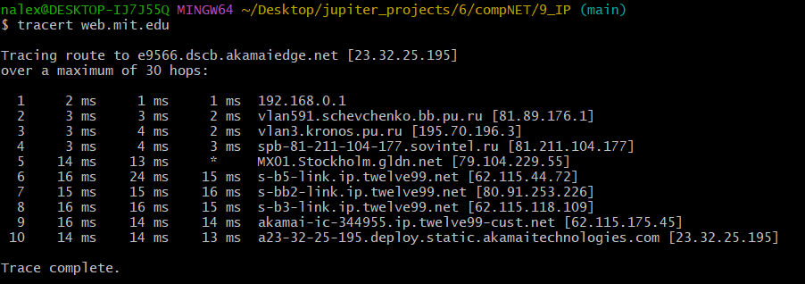
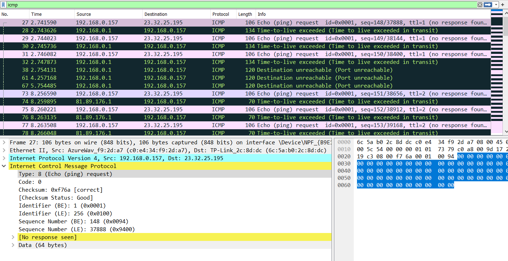
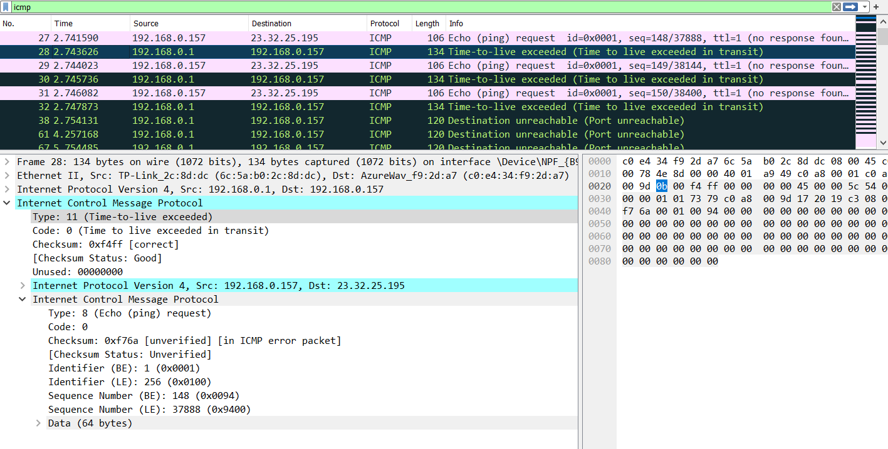

# Практика 9. Сетевой уровень (сдать до 27.04.2023) 

## 1. Ping (4 балла) 

Будем работать с web.mit.edu

1. IP хоста = `100.114.43.143`. IP хоста назначени = `23.32.25.195`

2. ICMP протокол предназначен для обмена данных между хостами [об ошибках или каких-то исключительных ситуацих], для этого не нужен порт. Порты нужны для передечи данных между процессов на соответсвующих хостах.

3. ACMP-Type = 8 [request], ACMP-Code=0. В ACMP пакете есть поля, `Type`, `Code`, `Checksum`, `Indentifier`, `Sequence Number`, информацио о времени отправитиля и `Data`. На поля `Checksum`, `Indentifier`, `Sequence Number` выделено по 2 байта.  

4. `Type` = 0 [reply], `Code`= 0. Аналогично предыдущему пакету.

## 2. Traceroute (4 балла) 
 

1. В целом отличий я не заметил, единственное я не вижу поле с информацией о времени отправки. 

2. Появилось много доп. информации, такой как:  
* адреса отправителя и получателя
* версии протокола
* TTL 
* И какая-та ещё информация менее понятная 
* В конце есть информация о эхо запросе без данных. Соответсвенно тип, код, сумма, индификатор, порядковый номер - каждый по 2 бита, значит всё  это занимает 10 байт.

3. Отличия есть. 

* Тип: 0 (а не 11)
* TTL не опустился ниже 1 [=54], до того как данные пришли до назначения
* Информация про IP пропала

4. Видно, что есть какая-та ощутимая задержка между 4 и 5 итерациями. 
* Санкт-Петербург, `spb-81-211-104-177.sovintel.ru [81.211.104.177] `

* Стокгольм, ` MX01.Stockholm.gldn.net [79.104.229.55]`

