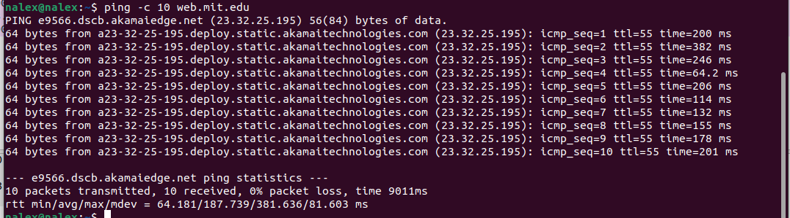
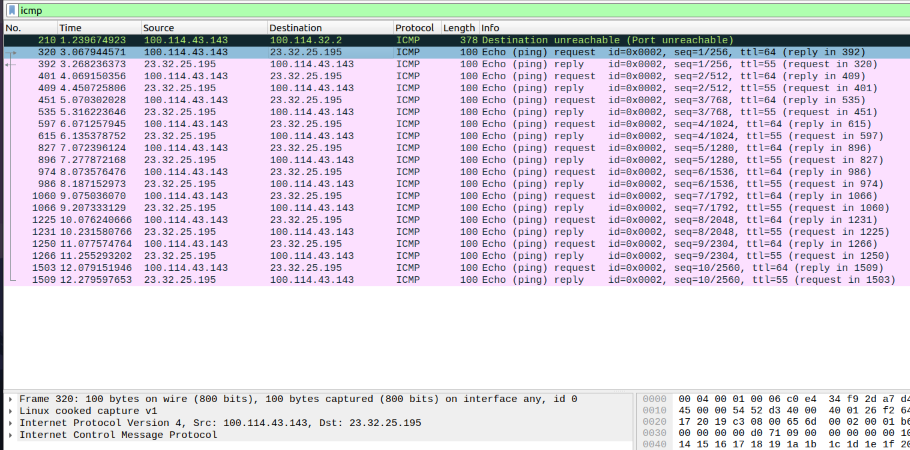
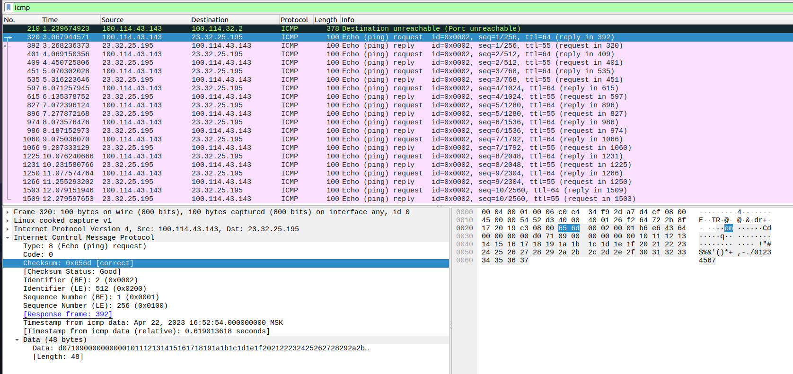
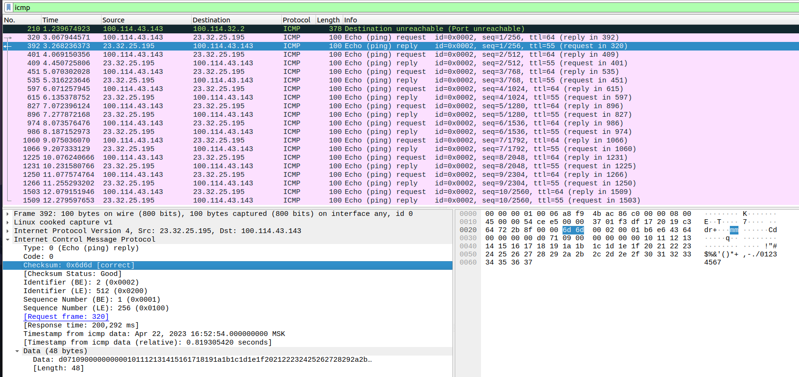

# Практика 9. Сетевой уровень (сдать до 27.04.2023) 

## 1. Ping (4 балла) 

Будем работать с https://web.mit.edu/

1. IP хоста = `100.114.43.143`. IP хоста назначени = `23.32.25.195`

2. ICMP протокол предназначен для обмена данных между хостами [об ошибках или каких-то исключительных ситуацих], для этого не нужен порт. Порты нужны для передечи данных между процессов на соответсвующих хостах.

3. ACMP-Type = 8 [request], ACMP-Code=0. В ACMP пакете есть поля, `Type`, `Code`, `Checksum`, `Indentifier`, `Sequence Number`, информацио о времени отправитиля и `Data`. На поля `Checksum`, `Indentifier`, `Sequence Number` выделено по 2 байта.  

4. `Type` = 0 [reply], `Code`= 0. Аналогично предыдущему пакету.

## 2. Traceroute (4 балла) 
